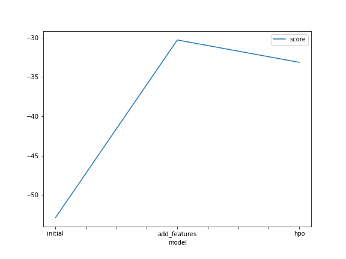
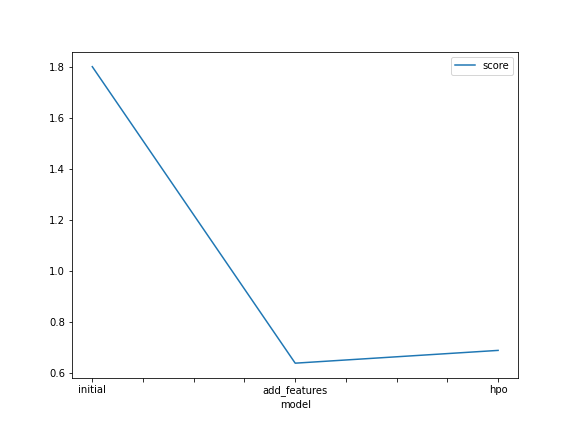

# Report: Predict Bike Sharing Demand with AutoGluon Solution
## Mehnaz Khan
## Initial Training
### What did you realize when you tried to submit your predictions? What changes were needed to the output of the predictor to submit your results?
At the beginning, I could not able to download the dataset from Kaggle through code, I needed to install Kaggle. Then it works.
One strange thing happened, I was trying to submit the predictions through kaggle, I found one negative value, I set that negative value to zero, then I was stuck in hyperparameter tuning, I needed to learn more about that, however, when I started from the beginning, I did not get any negative value and kaggle score gets higher to 
1.8.

### What was the top ranked model that performed?
The top ranked model was WeightedEnsemble_L3.

## Exploratory data analysis and feature creation
### What did the exploratory analysis find and how did you add additional features?
From the exploratory analysis, it is observed that date is in datetime format. We can make additional features by converting day, year, month to get more detatils information.

### How much better did your model preform after adding additional features and why do you think that is?
Adding additional features provides better accuracy, these additional features actually are more correlated to the target. 

## Hyper parameter tuning
### How much better did your model preform after trying different hyper parameters?
I tried different hyper parameters which provides the better results. 

### If you were given more time with this dataset, where do you think you would spend more time?
If I get more time with this dataset, I will try with different hyperparameter to tune to get more better results.

### Create a table with the models you ran, the hyperparameters modified, and the kaggle score.
|model|score|
|initial|1.8|
|add_features|0.64|
|hpo|0.69|

### Create a line plot showing the top model score for the three (or more) training runs during the project.

### Create a line plot showing the top kaggle score for the three (or more) prediction submissions during the project.

## Summary
This is a good project to get the idea how to utilize Autogluon library to predict the bike sharing demand and improve the model by hyper parameter tuning.
